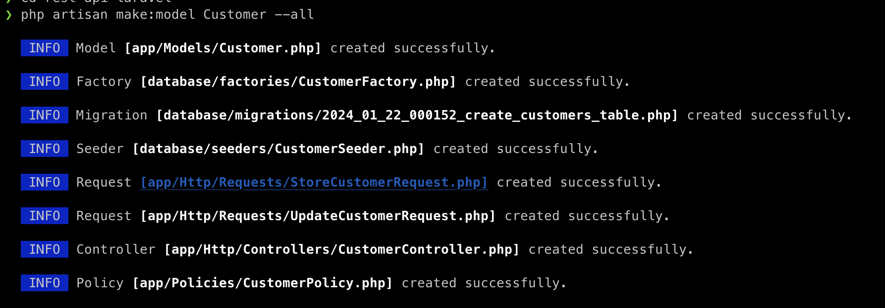

<p align="center"><a href="https://laravel.com" target="_blank"></a></p>

<p align="center">
<a href="https://github.com/laravel/framework/actions"></a>
<a href="https://packagist.org/packages/laravel/framework"></a>
<a href="https://packagist.org/packages/laravel/framework"></a>
<a href="https://packagist.org/packages/laravel/framework"></a>
</p>

## à propos de Laravel

Laravel est un framework d'application web avec une syntaxe expressive et élégante. Nous pensons que le développement doit être une expérience agréable et créative pour être vraiment satisfaisant. Laravel soulage le développement en facilitant les tâches courantes utilisées dans de nombreux projets web, telles que :

- [Moteur de routage simple et rapide](https://laravel.com/docs/routing).
- [Puissant conteneur d'injection de dépendances](https://laravel.com/docs/container).
- Conteneur puissant d'injection de dépendancesMultiples back-ends pour la [session](https://laravel.com/docs/session) and [cache](https://laravel.com/docs/cache) storage.
- Expressif, intuitif [database ORM](https://laravel.com/docs/eloquent).
- agnostique en matière de base de données [schema migrations](https://laravel.com/docs/migrations).
- [Traitement robuste des tâches en arrière-plan](https://laravel.com/docs/queues).
- [Diffusion d'événements en temps réel](https://laravel.com/docs/broadcasting).

Laravel est accessible, puissant et fournit les outils nécessaires à la réalisation d'applications robustes et de grande envergure.

## Apprendre Laravel

Laravel est le système le plus complet et le plus approfondi [documentation](https://laravel.com/docs) et une bibliothèque de tutoriels vidéo de tous les frameworks d'applications web modernes, ce qui facilite la prise en main du framework.

Vous pouvez également essayer le [Laravel Bootcamp](https://bootcamp.laravel.com), où vous serez guidé dans la construction d'une application Laravel moderne à partir de zéro.

Si vous n'avez pas envie de lire, [Laracasts](https://laracasts.com) peut vous aider. Laracasts contient plus de 2000 tutoriels vidéo sur un large éventail de sujets, y compris Laravel, PHP moderne, tests unitaires et JavaScript. Améliorez vos compétences en piochant dans notre bibliothèque vidéo complète.

## Laravel Sponsors

Nous tenons à remercier les sponsors suivants qui financent le développement de Laravel. Si vous souhaitez devenir un sponsor, veuillez visiter le. [Programme des partenaires Laravel](https://partners.laravel.com).

### Partenaires Premium

- **[Vehikl](https://vehikl.com/)**
- **[Tighten Co.](https://tighten.co)**
- **[WebReinvent](https://webreinvent.com/)**
- **[Kirschbaum Development Group](https://kirschbaumdevelopment.com)**
- **[64 Robots](https://64robots.com)**
- **[Curotec](https://www.curotec.com/services/technologies/laravel/)**
- **[Cyber-Duck](https://cyber-duck.co.uk)**
- **[DevSquad](https://devsquad.com/hire-laravel-developers)**
- **[Jump24](https://jump24.co.uk)**
- **[Redberry](https://redberry.international/laravel/)**
- **[Active Logic](https://activelogic.com)**
- **[byte5](https://byte5.de)**
- **[OP.GG](https://op.gg)**

## Contributing

Merci d'envisager de contribuer au framework Laravel ! Le guide de contribution se trouve dans la section [Documentation de laravel](https://laravel.com/docs/contributions).

## Code de conduite

Afin de s'assurer que la communauté Laravel est accueillante pour tous, nous vous demandons de bien vouloir prendre connaissance et de respecter les règles suivantes [Code de conduite](https://laravel.com/docs/contributions#code-of-conduct).

## Vulnérabilités en matière de sécurité

Si vous découvrez une faille de sécurité dans Laravel, veuillez envoyer un courriel à Taylor Otwell via [taylor@laravel.com](mailto:taylor@laravel.com). Toutes les failles de sécurité seront rapidement corrigées.

## License

Le framework Laravel est un logiciel open-source sous licence de la [MIT license](https://opensource.org/licenses/MIT).


## php artisan make:model nom_du_model --all

- Elle crée un nouveau modèle Eloquent avec le nom nom_du_model
- L'option --all indique de également générer un controller, Seeder, migration, factory, policy une fabrique et une ressource pour ce model.



## Factory

Les factories dans Laravel jouent un rôle important pour générer des données de test pour les modèles

- Générer facilement des enregistrements factices en base de données pour les tests. Au lieu d'insérer manuellement des données
- Tester le modèle avec des données aléatoires à chaque exécution des tests. La factory permet de ne pas réutiliser les mêmes données statiques.

```php
<?php

namespace Database\Factories;

use Illuminate\Database\Eloquent\Factories\Factory;

/**
 * @extends \Illuminate\Database\Eloquent\Factories\Factory<\App\Models\Customer>
 */
class CustomerFactory extends Factory
{
    /**
     * Define the model's default state.
     *
     * @return array<string, mixed>
     */
    public function definition(): array
    {
        $type = $this->faker->randomElement(['I', 'B']);
        $name = $type == 'I' ? $this->faker->name() : $this->faker->company();


        return [
            'name'=> $name,
            'type'=> $type,
            'email'=> $this->faker->email(),
            'address'=> $this->faker->streetAddress(),
            'city'=> $this->faker->city(),
            'state'=> $this->faker->state(),
            'postal_code'=> $this->faker->postcode(),
            //
        ];
    }
}

```

## Seeders

Les seeders dans Laravel servent à peupler la base de données avec des données initiales ou de référence.

- Insérer des données de référence nécessaires au fonctionnement de l'application, comme des utilisateurs système, des rôles, des paramètres... Ces données doivent être disponibles quelle que soit la situation de la base.
- Fournir un jeu de données réaliste mais cohérent pour les développeurs, pour simuler un état de la base correspondant au lancement d'un site. Par exemple créer quelques catégories et articles factices.
- Générer un volume important de données réalistes pour des tests de performance ou de charge.

Bien qu'ils puissent avoir des usages communs, les seeders sont complémentaires des factories :

- Les factories génèrent des données aléatoires, les seeders insèrent des données définies.
- Les factories sont plus adaptées pour les tests, les seeders pour fournir un état initial fiable de la base.
- On peut combiner factories et seeders pour générer des volumes importants de données cohérentes.

```php
<?php

namespace Database\Seeders;

use App\Models\Customer;
use Illuminate\Database\Console\Seeds\WithoutModelEvents;
use Illuminate\Database\Seeder;

class CustomerSeeder extends Seeder
{
    /**
     * Run the database seeds.
     */
    public function run(): void
    {
        Customer::factory()->count(20)->hasInvoices(5)->create();
        Customer::factory()->count(15)->hasInvoices(10)->create();
        Customer::factory()->count(10)->hasInvoices(15)->create();
        Customer::factory()->count(5)->hasInvoices(20)->create();
        Customer::factory()->count(7)->create();
    }
}

```
## Migrations

Les migrations dans Laravel jouent un rôle très important dans la gestion du schéma de la base de données d'une application.

- Créer/modifier les tables de la base de données durant le développement, de manière simple et structurée. Les migrations permettent d'ajouter/supprimer des colonnes, indexes, clés étrangères, etc.
- Offrir une alternative simple et fiable aux changements de schéma manuels risqués.
- Versionner les changements de schéma en base au fil du temps et pouvoir appliquer ou annuler ces changements si besoin.

```php
<?php

use Illuminate\Database\Migrations\Migration;
use Illuminate\Database\Schema\Blueprint;
use Illuminate\Support\Facades\Schema;

return new class extends Migration
{
    /**
     * Run the migrations.
     */
    public function up(): void
    {
        Schema::create('invoices', function (Blueprint $table) {
            $table->id();
            $table->integer('customer_id');
            $table->integer('amount');
            $table->string('status'); //billed; paid, Void
            $table->dateTime('billed_date');
            $table->dateTime('paid_date')->nullable();
            $table->timestamps();
        });
    }

    /**
     * Reverse the migrations.
     */
    public function down(): void
    {
        Schema::dropIfExists('invoices');
    }
};

```

## La différence principale entre use et namespace en Laravel est 

### namespace

namespace permet de définir l'espace de noms (namespace) d'une classe PHP. Toutes les classes Laravel sont organisées dans des namespaces comme App, Database, Auth etc.

### use

use permet d'importer une classe PHP pour pouvoir l'utiliser sans préfixer son namespace complet.

```php
namespace App\Http\Controllers\Api\v1;

use App\Http\Requests\StoreCustomerRequest;
use App\Http\Requests\UpdateCustomerRequest;
use App\Models\Customer;
use App\Http\Controllers\Controller;

```