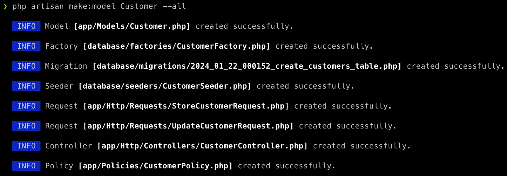

<p align="center"><a href="https://laravel.com" target="_blank"></a></p>

<p align="center">
<a href="https://github.com/laravel/framework/actions"></a>
<a href="https://packagist.org/packages/laravel/framework"></a>
<a href="https://packagist.org/packages/laravel/framework"></a>
<a href="https://packagist.org/packages/laravel/framework"></a>
</p>

## About Laravel

Laravel is a web application framework with expressive, elegant syntax. We believe development must be an enjoyable and creative experience to be truly fulfilling. Laravel takes the pain out of development by easing common tasks used in many web projects, such as:

- [Simple, fast routing engine](https://laravel.com/docs/routing).
- [Powerful dependency injection container](https://laravel.com/docs/container).
- Multiple back-ends for [session](https://laravel.com/docs/session) and [cache](https://laravel.com/docs/cache) storage.
- Expressive, intuitive [database ORM](https://laravel.com/docs/eloquent).
- Database agnostic [schema migrations](https://laravel.com/docs/migrations).
- [Robust background job processing](https://laravel.com/docs/queues).
- [Real-time event broadcasting](https://laravel.com/docs/broadcasting).

Laravel is accessible, powerful, and provides tools required for large, robust applications.

## Learning Laravel

Laravel has the most extensive and thorough [documentation](https://laravel.com/docs) and video tutorial library of all modern web application frameworks, making it a breeze to get started with the framework.

You may also try the [Laravel Bootcamp](https://bootcamp.laravel.com), where you will be guided through building a modern Laravel application from scratch.

If you don't feel like reading, [Laracasts](https://laracasts.com) can help. Laracasts contains over 2000 video tutorials on a range of topics including Laravel, modern PHP, unit testing, and JavaScript. Boost your skills by digging into our comprehensive video library.

## Laravel Sponsors

We would like to extend our thanks to the following sponsors for funding Laravel development. If you are interested in becoming a sponsor, please visit the [Laravel Partners program](https://partners.laravel.com).

### Premium Partners

- **[Vehikl](https://vehikl.com/)**
- **[Tighten Co.](https://tighten.co)**
- **[WebReinvent](https://webreinvent.com/)**
- **[Kirschbaum Development Group](https://kirschbaumdevelopment.com)**
- **[64 Robots](https://64robots.com)**
- **[Curotec](https://www.curotec.com/services/technologies/laravel/)**
- **[Cyber-Duck](https://cyber-duck.co.uk)**
- **[DevSquad](https://devsquad.com/hire-laravel-developers)**
- **[Jump24](https://jump24.co.uk)**
- **[Redberry](https://redberry.international/laravel/)**
- **[Active Logic](https://activelogic.com)**
- **[byte5](https://byte5.de)**
- **[OP.GG](https://op.gg)**

## Contributing

Thank you for considering contributing to the Laravel framework! The contribution guide can be found in the [Laravel documentation](https://laravel.com/docs/contributions).

## Code of Conduct

In order to ensure that the Laravel community is welcoming to all, please review and abide by the [Code of Conduct](https://laravel.com/docs/contributions#code-of-conduct).

## Security Vulnerabilities

If you discover a security vulnerability within Laravel, please send an e-mail to Taylor Otwell via [taylor@laravel.com](mailto:taylor@laravel.com). All security vulnerabilities will be promptly addressed.

## License

The Laravel framework is open-sourced software licensed under the [MIT license](https://opensource.org/licenses/MIT).


## php artisan make:model nom_du_model --all

- Elle crée un nouveau modèle Eloquent avec le nom nom_du_model
- L'option --all indique de également générer un controller, Seeder, migration, factory, policy une fabrique et une ressource pour ce model.



## Factory

Les factories dans Laravel jouent un rôle important pour générer des données de test pour les modèles

- Générer facilement des enregistrements factices en base de données pour les tests. Au lieu d'insérer manuellement des données
- Tester le modèle avec des données aléatoires à chaque exécution des tests. La factory permet de ne pas réutiliser les mêmes données statiques.

```php
<?php

namespace Database\Factories;

use Illuminate\Database\Eloquent\Factories\Factory;

/**
 * @extends \Illuminate\Database\Eloquent\Factories\Factory<\App\Models\Customer>
 */
class CustomerFactory extends Factory
{
    /**
     * Define the model's default state.
     *
     * @return array<string, mixed>
     */
    public function definition(): array
    {
        $type = $this->faker->randomElement(['I', 'B']);
        $name = $type == 'I' ? $this->faker->name() : $this->faker->company();


        return [
            'name'=> $name,
            'type'=> $type,
            'email'=> $this->faker->email(),
            'address'=> $this->faker->streetAddress(),
            'city'=> $this->faker->city(),
            'state'=> $this->faker->state(),
            'postal_code'=> $this->faker->postcode(),
            //
        ];
    }
}

```

## Seeders

Les seeders dans Laravel servent à peupler la base de données avec des données initiales ou de référence.

- Insérer des données de référence nécessaires au fonctionnement de l'application, comme des utilisateurs système, des rôles, des paramètres... Ces données doivent être disponibles quelle que soit la situation de la base.
- Fournir un jeu de données réaliste mais cohérent pour les développeurs, pour simuler un état de la base correspondant au lancement d'un site. Par exemple créer quelques catégories et articles factices.
- Générer un volume important de données réalistes pour des tests de performance ou de charge.

Bien qu'ils puissent avoir des usages communs, les seeders sont complémentaires des factories :

- Les factories génèrent des données aléatoires, les seeders insèrent des données définies.
- Les factories sont plus adaptées pour les tests, les seeders pour fournir un état initial fiable de la base.
- On peut combiner factories et seeders pour générer des volumes importants de données cohérentes.

```php
<?php

namespace Database\Seeders;

use App\Models\Customer;
use Illuminate\Database\Console\Seeds\WithoutModelEvents;
use Illuminate\Database\Seeder;

class CustomerSeeder extends Seeder
{
    /**
     * Run the database seeds.
     */
    public function run(): void
    {
        Customer::factory()->count(20)->hasInvoices(5)->create();
        Customer::factory()->count(15)->hasInvoices(10)->create();
        Customer::factory()->count(10)->hasInvoices(15)->create();
        Customer::factory()->count(5)->hasInvoices(20)->create();
        Customer::factory()->count(7)->create();
    }
}

```
## Migrations

Les migrations dans Laravel jouent un rôle très important dans la gestion du schéma de la base de données d'une application.

- Créer/modifier les tables de la base de données durant le développement, de manière simple et structurée. Les migrations permettent d'ajouter/supprimer des colonnes, indexes, clés étrangères, etc.
- Offrir une alternative simple et fiable aux changements de schéma manuels risqués.
- Versionner les changements de schéma en base au fil du temps et pouvoir appliquer ou annuler ces changements si besoin.

```php
<?php

use Illuminate\Database\Migrations\Migration;
use Illuminate\Database\Schema\Blueprint;
use Illuminate\Support\Facades\Schema;

return new class extends Migration
{
    /**
     * Run the migrations.
     */
    public function up(): void
    {
        Schema::create('invoices', function (Blueprint $table) {
            $table->id();
            $table->integer('customer_id');
            $table->integer('amount');
            $table->string('status'); //billed; paid, Void
            $table->dateTime('billed_date');
            $table->dateTime('paid_date')->nullable();
            $table->timestamps();
        });
    }

    /**
     * Reverse the migrations.
     */
    public function down(): void
    {
        Schema::dropIfExists('invoices');
    }
};

```

## La différence principale entre use et namespace en Laravel est 

### namespace

namespace permet de définir l'espace de noms (namespace) d'une classe PHP. Toutes les classes Laravel sont organisées dans des namespaces comme App, Database, Auth etc.

### use

use permet d'importer une classe PHP pour pouvoir l'utiliser sans préfixer son namespace complet.

```php
namespace App\Http\Controllers\Api\v1;

use App\Http\Requests\StoreCustomerRequest;
use App\Http\Requests\UpdateCustomerRequest;
use App\Models\Customer;
use App\Http\Controllers\Controller;

```